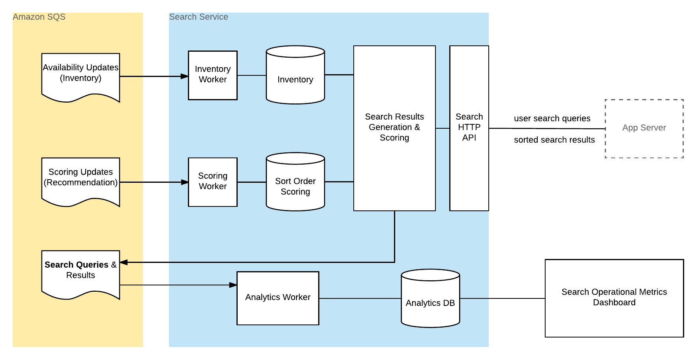

# Modelbnb Search Server Architecture

The server exposes an HTTP API for app servers to search available listings for a target market and travel date range.

Search requests are served as follows:
- query against a relational database for available listings
- query against a non-relational database for scoring rules to make applicable adjustments to the sort order of search results

The local inventory store is maintained by worker processes that consume updates that an external Inventory services publishes to the Search service's inventory queue. Similarly, the inventory scoring data store is maintained by worker processes that consume updates that an external Recommendations service publishes to the Search service's recommendations queue.

For each search request served, the server publishes search event messages to the queues of all subscribed services, including the Search service's own search queue. Search event messages include information on the search parameters, search results and logging of time taken by each operation of the search request handling. Analytics worker processes of the Search service consume and index the search data in Elastic Search so that operational metrics can be monitored via a Kibana dashboard.

